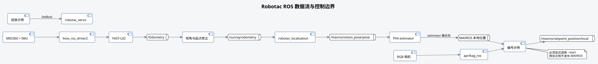

# 本 Repo 结构

## 本 Repo 用途

Robotac 是 ROS Noetic 教学示例工作空间。它提供定位接入、MAVROS 位置控制、AprilTag
目标处理和投放机构控制的可运行示例，供参赛选手在指定无人机平台上逐项验证并编排比赛程序。

## 包含的内容

本 Repo 包含：

- 传感器、FAST-LIO、AprilTag 和 MAVROS 的基础启动文件；
- 一个将 FAST-LIO 里程计转换为 PX4 外部视觉位姿的节点；
- 11 个可单独阅读、单独启动的示例；
- 启动前检查、纯单元测试和简化假飞控仿真。

参赛队仍须根据正式规则确定障碍路线、任务顺序、计时、投放判定和返航方式。安全操作员、
遥控器接管和现场清场由现场人员负责。

## 目录用途

| 路径 | 类型 | 用途 |
| --- | --- | --- |
| `src/robotac_bringup` | 项目自有 | 硬件配置和基础组件 launch |
| `src/robotac_localization` | 项目自有 | `Odometry` 到外部视觉位姿 |
| `src/robotac_examples` | 项目自有 | 编号示例、公共函数和测试 |
| `src/robotac_servo` | 项目自有 | 投放机构驱动和标定工具 |
| `tools` | 项目自有 | 安装、构建、测试、同步 |
| `docs` | 项目自有 | 中文技术资料和教程 |
| `src/mavros` | 第三方 | PX4 与 ROS 接口 |
| `src/apriltag*` | 第三方 | AprilTag 检测和 ROS 封装 |
| `src/fast_lio` | 第三方 | 激光惯性里程计 |
| `src/livox_ros_driver2`、`src/Livox-SDK2` | 第三方 | Livox 驱动和 SDK |
| `src/web_cam` | 第三方 | RGB 相机节点 |

配置文件随所属 ROS 包安装，不再存在顶层 `config/` 副本。

## 数据流向

FAST-LIO 先发布 `/Odometry`。当前项目使用的修正程序根据启动阶段的 IMU 数据修正初始倾角，
并以第一帧里程计作为原点，随后发布 `/sunray/odometry`。该位姿经 MAVROS 送入 PX4，只有
PX4 estimator 完成融合后，飞行示例才从 `/mavros/local_position/pose` 获得最终本地位置。

定位预览 launch 不向 PX4 发布。`flight_base.launch` 会把外部视觉位姿发送给 PX4，但不会
控制飞机。需要飞行的示例必须另行调用 `~start`。

## 教学顺序

推荐按以下顺序完成：

1. FCU 状态、定位链路和本地位姿只读检查；
2. AprilTag 原始检测和本地坐标转换；
3. 位置设定点与视觉对准预览；
4. 假飞控仿真；
5. 拆桨地面联调；
6. 受控悬停、位移、航点和 Tag 对准；
7. 独立舵机台架检查。

具体验证步骤见[安全与验证](06-safety-and-validation.md)。
