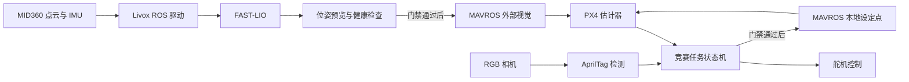

# 项目总览

## 竞赛背景

Robotac 面向 ROBOTAC AIROBOTIC C 组无人机实机任务。当前软件覆盖以下最小任务闭环：
无人机自主起飞，按本地航线绕过固定障碍，在目标区域识别 AprilTag 并对准，执行一次
模拟货物释放，随后返航并降落。

本节仅对软件任务边界作必要摘要，不构成正式规则副本。场地、标识、计时、判分和设备
登记要求必须以组委会最新正式文件、技术通知和现场解释为准。

## 仓库用途

本 Repo 是一套 ROS1 源码工作空间，用于集成机载感知、定位、飞控接口和竞赛任务，
并为各高风险阶段设置可核验的前置条件。Repo 同时包含第三方源码和 Robotac 自有包，
因此体积较大；参赛开发范围原则上限定于 `src/robotac_*`、`config/` 和 `scripts/`。

## 能力边界

本 Repo 提供：

- MID360 点云与 IMU 接入。
- FAST-LIO 本地里程计和点云输出。
- 外部视觉位姿的预览、健康判断和受控输出。
- MAVROS 本地位置、状态、时间同步与原始本地设定点接口。
- RGB 相机和 AprilTag 检测。
- 通用本地航点任务与 C 组投放任务状态机。
- 舵机串口控制、状态回执和分级验证工具。

本 Repo 不覆盖：

- 飞机结构、电气、重心和动力安全评估。
- 雷达、IMU、相机和机体外参的现场测量。
- PX4 EKF、Offboard 失联保护和遥控接管的配置与验证。
- 组委会最终规则参数和现场安全管理。
- 完整赛道实飞、重复投放精度或比赛成绩证明。

## 目录职责

| 路径 | 归属 | 说明 |
| --- | --- | --- |
| `src/robotac_bringup` | 项目自有 | 组合各子系统的 launch 和运行入口 |
| `src/robotac_flight` | 项目自有 | 位姿转换、飞行前检查、航点与竞赛任务 |
| `src/robotac_servo` | 项目自有 | 投放舵机控制 |
| `config` | 项目自有 | 硬件、任务、标定和部署门禁配置 |
| `scripts` | 项目自有 | 构建、同步、检查和证据工具 |
| `src/livox_ros_driver2` | 第三方 | Livox ROS1 驱动 |
| `src/Livox-SDK2` | 第三方 | Livox 本机 SDK |
| `src/fast_lio` | 第三方及少量集成修改 | 激光雷达惯性里程计 |
| `src/mavros` | 第三方及项目适配 | PX4 的 ROS/MAVLink 桥接 |
| `src/apriltag`、`src/apriltag_ros` | 第三方 | Tag 检测算法和 ROS 封装 |
| `src/web_cam` | 第三方 | V4L2 相机驱动 |
| `versions.lock`、`.repos` | 版本管理 | 精确版本和上游来源 |

## 系统架构

## 核心数据流

1. MID360 驱动发布 `/livox/lidar` 和 `/livox/imu`。
2. FAST-LIO 融合数据并发布 `/Odometry`，其世界/机体帧为 `camera_init` 和 `body`。
3. Robotac 位姿适配器检查时间戳、跳变、协方差和坐标变换，先发布预览。
4. 标定与部署门禁通过后，位姿才可输出到 `/mavros/vision_pose/pose`。
5. PX4 经 MAVROS 提供 `/mavros/local_position/odom` 和飞控状态。
6. RGB 相机和 AprilTag 节点提供 `/tag_detections`。
7. 任务状态机综合本地位置、Tag、MAVROS 状态和舵机回执，生成预览或受控设定点。

## 两类任务控制器

`local_waypoint_flight.py` 是通用本地航点控制器，可从 YAML 或 `PoseArray` 接收航线，
用于基础闭环和分阶段飞行测试。

`tag_payload_mission.py` 是竞赛任务控制器，将固定航线、Tag 确认、投放、返航和降落
组织为一套状态机。两者共享外部视觉、MAVROS 状态和部署门禁，但服务命名空间不同。

## 预览与实际输出隔离

预览用于验证坐标方向、频率、时间戳和目标位置，不得影响飞控。实际输出进入 MAVROS
或设定点插件，具有不同风险等级。因此默认配置仅允许预览；启用实际输出还须显式设置参数，
并同时满足部署门禁、实时消费者、数据健康和飞控状态要求。

## 后续文档

- 软件环境：[环境与构建](02-environment-and-build.md)
- 硬件接线与标定：[硬件与配置](03-hardware-and-configuration.md)
- 接口定义：[架构与接口](04-architecture-and-interfaces.md)
- 任务流程：[竞赛任务](05-competition-mission.md)

[返回文档索引](README.md)
