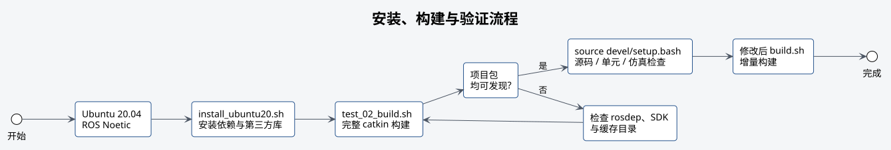

# 环境与构建



## 基线环境

| 项目 | 要求 |
| --- | --- |
| 操作系统 | Ubuntu 20.04 LTS |
| ROS | ROS Noetic |
| Python | Python 3.8 |
| 构建工具 | catkin、CMake、GCC |
| 飞控接口 | PX4 与 MAVROS 1.x |

macOS 可以执行源码检查和不依赖 ROS 的单元测试，但 ROS Noetic 构建和仿真必须在
Ubuntu 20.04 上完成。

## 首次安装

目标机须预先安装 Ubuntu 20.04 和 ROS Noetic。Jetson Orin Nano、Nano Super 和 Orin NX
首次安装时使用以下部署脚本：

```bash
# 进入工作空间目录。
cd ~/robotac_ws
# 完成平台预检、依赖和定制 SDK 安装、比赛构建及离线测试。
./tools/setup_jetson_orin.sh
# 加载构建后的工作空间环境。
source devel/setup.bash
```

部署脚本只接受 ARM64 的 Jetson Orin Nano、Nano Super 或 Orin NX，以及 Ubuntu 20.04
和 ROS Noetic 环境，并要求由工作空间所有者以普通用户身份运行。它不会启动 ROS 节点、
不连接飞机、不安装硬件 udev、不写雷达持久网络，也不修改 PX4 参数。脚本完成后，表示依赖
已经安装、工作空间已经构建并完成离线检查；雷达、相机、飞控、舵机和机械机构仍须按硬件配置
文档逐项确认。旧入口 `./tools/setup_orin_nano_super.sh` 继续保留，并转发到相同的部署流程。

依赖安装脚本 `install_ubuntu20.sh` 安装 apt 与 rosdep 依赖，并构建系统级 `Livox-SDK2` 和
`apriltag`。比赛运行构建使用系统预编译的 MAVROS、MAVROS Extras 和 AprilTag ROS；安装
脚本会一并安装对应的 Noetic 包。项目不下载 GeographicLib 数据集，当前 MAVROS 白名单也
不启用全局定位插件。
第三方库和 catkin 默认使用
`nproc - 1` 个并行任务
（单核主机使用 1 个），为系统和 ROS 进程保留一个逻辑 CPU。内存受限时可显式降低
`ROBOTAC_BUILD_JOBS`，资源充足时也可按需覆盖：

```bash
# 使用 4 个并行任务安装依赖。
ROBOTAC_BUILD_JOBS=4 ./tools/install_ubuntu20.sh
# 使用 4 个并行任务完成安装、构建和检查。
ROBOTAC_BUILD_JOBS=4 ./tools/setup_jetson_orin.sh
# 使用 4 个并行任务执行 catkin 构建。
ROBOTAC_BUILD_JOBS=4 ./tools/test_02_build.sh
```

## 比赛运行构建

```bash
# 只编译比赛运行需要的本地包，并检查系统 ROS 包没有被源码遮蔽。
./tools/test_02_build.sh
# 加载构建后的工作空间环境。
source devel/setup.bash
```

比赛运行构建编译 `livox_ros_driver2`、`fast_lio`、`web_cam` 和四个 Robotac 自有包。
`libmavconn`、`mavros_msgs`、`mavros`、`mavros_extras` 和 `apriltag_ros` 直接使用
`/opt/ros/noetic` 的二进制包。构建成功后应能发现以下项目包：

```bash
# 查找硬件启动包。
rospack find robotac_bringup
# 查找定位包。
rospack find robotac_localization
# 查找教学示例包。
rospack find robotac_examples
# 查找舵机驱动包。
rospack find robotac_servo
```

## 日常增量构建

```bash
# 执行日常 catkin 增量构建。
./tools/build.sh
# 重新加载工作空间环境。
source devel/setup.bash
```

修改 Python、launch 或配置后仍应重新执行源码检查。修改本地比赛包的 `package.xml`、CMake
或消息依赖后，重新执行比赛运行构建。

## 全源码构建

需要验证仓库内 MAVROS、MAVROS Extras、AprilTag ROS 和上游测试包时执行：

```bash
# 在独立 build/full 和 devel_full 中构建全部源码包。
./tools/build_full.sh
# 仅在验证全源码构建结果时加载该环境。
source devel_full/setup.bash
```

全源码构建不覆盖比赛运行环境 `devel`，日常运行仍应加载 `devel/setup.bash`。

## 离线测试

```bash
# 检查源码、接口和文档链接。
./tools/test_01_source.sh
# 运行纯单元测试。
./tools/test_03_unit.sh
# 运行简化假飞控仿真。
./tools/test_04_simulation.sh
```

各工具检查的内容如下：

| 工具 | 检查范围 |
| --- | --- |
| `test_01_source.sh` | Python 语法、行数、XML、YAML、JSON、路径、接口、文档链接 |
| `test_02_build.sh` | 比赛运行构建、系统包来源和项目包发现 |
| `test_03_unit.sh` | 坐标、Tag 筛选、航点解析、定位检查、舵机协议 |
| `test_04_simulation.sh` | 假飞控下的启动前检查、飞行示例、停止和故障降落 |
| `test_05_hardware_readonly.sh` | 真实设备与 ROS 数据只读检查 |

`test_05_hardware_readonly.sh` 不属于离线测试，不应在容器或无设备环境执行。

## 常见构建问题

### 未找到 ROS Noetic

确认 `/opt/ros/noetic/setup.bash` 存在，并在 Ubuntu 20.04 执行。不得用其他 ROS 发行版的
环境变量继续构建。

### rosdep 未初始化

```bash
# 初始化 rosdep（仅在系统尚未初始化时执行）。
sudo rosdep init
# 更新 rosdep 依赖索引。
rosdep update
```

系统已初始化时不重复执行 `rosdep init`。

### 找不到 Livox SDK 或 apriltag

重新执行 `tools/install_ubuntu20.sh`，检查 `cmake --install` 与 `ldconfig` 是否成功。不要在
第三方源码目录中临时复制动态库。

### 构建目录来自其他机器

`build/` 和 `devel/` 不应跨机器同步。删除本机生成目录后重新构建；该操作不得影响 `src/`
和未提交源码。

## 下一步

首次连接真实硬件时，不要直接启动整套 bringup。先按[硬件与配置](03-hardware-and-configuration.md)
运行 `sensor_setup.py`，确认机载网卡地址、雷达地址和相机稳定设备名，再分别启动传感器节点。
