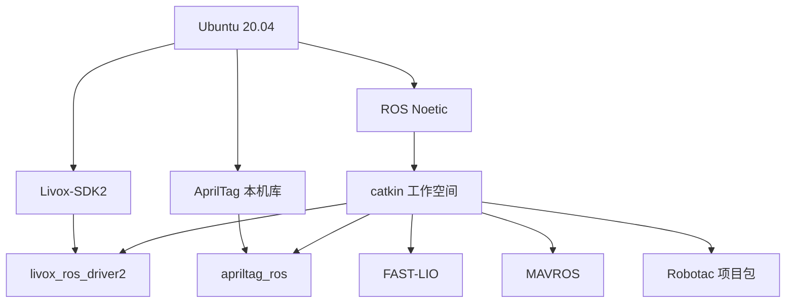

# 环境与构建

## 支持范围

本仓库指定 Ubuntu 20.04 与 ROS Noetic。macOS 仅用于代码管理，ROS 构建、
测试和运行应在 Ubuntu 20.04 主机上完成。其他 Ubuntu/ROS 版本的编译结果不纳入受支持范围。

## 硬件基线

| 类别 | 基线 |
| --- | --- |
| 机载计算机 | Ubuntu 20.04，具备以太网、USB/串口和足够散热 |
| 雷达 | Livox MID360 系列 |
| 飞控 | PX4，使用 MAVROS 串口链路 |
| 相机 | V4L2 兼容 RGB 相机 |
| 投放机构 | USB 串口 PWM 控制器和机械舵机 |

实际设备型号、固件、接口位置和供电必须由本队记录，禁止沿用其他飞机的设备路径。

## 软件依赖关系



MAVROS 由仓库源码构建，禁止与另一份 apt MAVROS 混用。AprilTag 作为本机 CMake
库安装，`src/apriltag/CATKIN_IGNORE` 用于避免 catkin 将同一源码重复作为 ROS 包构建。

## 首次构建

在 Ubuntu 20.04 中进入仓库根目录：

```bash
cd <工作空间目录>
./scripts/bootstrap_ubuntu20.sh
```

脚本将检查系统和权限，安装 Livox SDK、AprilTag、本机与 ROS 依赖，然后执行 Release
构建。运行前应确认：

- 系统确为 Ubuntu 20.04，`/opt/ros/noetic` 存在。
- 当前用户具备经实验室授权的安装权限。
- 网络软件源可用，磁盘空间充足。
- 仓库内容完整，`src/` 内第三方源码齐全。

首次构建完成后加载环境：

```bash
source /opt/ros/noetic/setup.bash
source devel/setup.bash
```

## 增量构建

仅修改项目代码或配置后，可在已准备好的 Ubuntu 工作空间执行：

```bash
cd <工作空间目录>
source /opt/ros/noetic/setup.bash
catkin_make -DCMAKE_BUILD_TYPE=Release -DROS_EDITION=ROS1
source devel/setup.bash
```

配置和文档变更通常不需要重编译，但仍应执行契约和工作空间检查。

## 构建结果检查

```bash
./scripts/check_flight_contract.py
./scripts/verify_workspace.sh
```

应重点确认：

- `robotac_bringup`、`robotac_flight`、`robotac_servo` 能被 `rospack find` 找到。
- 项目 launch 能解析，所引用的配置文件存在。
- Python 和 shell 入口具备执行权限。
- 契约检查没有发现默认控制输出、缺失门禁或接口漂移。
- 离线测试能够在无硬件条件下完成。

`verify_workspace.sh` 可能根据当前环境执行 ROS 相关离线测试；该脚本不得启动实机节点或发送
飞行命令。如果环境缺少 ROS，脚本将明确报告条件不足；不得将“未运行”记录为“已通过”。

## 常见构建问题

### ROS Noetic 缺失

确认操作系统和 ROS 安装，不得通过修改脚本绕过版本检查。其他系统应使用隔离的 Ubuntu
20.04 环境。

### FAST-LIO 生成消息头缺失

确认源码完整且构建环境无残留后，重新执行项目指定构建命令。禁止手工复制生成文件。

### AprilTag 被重复构建

确认 `src/apriltag/CATKIN_IGNORE` 存在，且本机 AprilTag 库按引导脚本安装。

### MAVROS 或 GeographicLib 报错

项目默认使用本地位置插件集合。须先检查 `config/mavros/px4_pluginlists.yaml` 是否保持项目
版本；只有明确启用全局定位插件时，才按 MAVROS 上游要求准备地理数据。

### 权限不足

构建权限与设备权限相互独立。`dialout`、`video` 仅影响串口和相机访问，不应通过
`chmod 777` 处理。按 [硬件与配置](03-hardware-and-configuration.md) 安装核验后的 udev 规则。

## 构建证据记录

每次发布或比赛冻结版本至少记录：

- Git 提交 SHA。
- Ubuntu 和 ROS 版本。
- 构建命令及退出状态。
- `check_flight_contract.py` 与 `verify_workspace.sh` 结果。
- 未执行项目及原因。

构建通过仅能证明源码可在该环境完成构建，不证明雷达、飞控、相机、舵机或整机飞行可用。

[返回文档索引](README.md)
