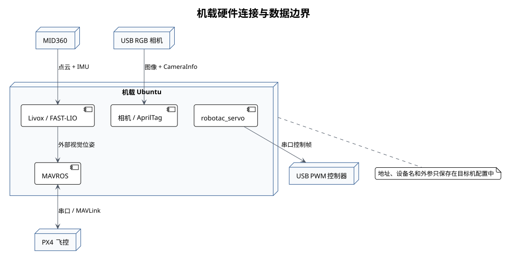

# 硬件与配置



## 首次启动前必须完成

构建成功不表示传感器已经可用。首次连接真实设备时，必须先完成以下工作：

1. 识别连接雷达的物理以太网接口，为该接口准备机载网卡地址；
2. 使用 Livox SDK 发现真实雷达地址，并填写 MID360s 配置；
3. 识别 RGB 相机的视频采集节点，确认稳定设备别名和目标采集模式；
4. 分别启动雷达和相机并读取原始 ROS 数据，再启动 FAST-LIO 或整套 bringup。

在机载工作空间中，使用以下命令识别并确认传感器：

```bash
# 进入机载工作空间并加载构建环境。
cd /home/yundrone/robotac
source devel/setup.bash
# 发现雷达并比较配置；任何写入都会再次询问。
./tools/sensor_setup.py lidar
# 识别相机采集节点和稳定别名。
./tools/sensor_setup.py camera
```

脚本不会在非交互环境写入配置；未发现设备时会明确报错，不会显示为成功。

## 硬件组成

本工作空间面向 MID360、PX4、USB RGB 相机和 USB PWM 舵机控制器。实际设备型号、固件、
接口电平和供电方式必须以目标飞机的装配记录为准。

## 配置位置

| 配置 | 路径 |
| --- | --- |
| MID360 网络 | `src/robotac_bringup/config/lidar/mid360s.json` |
| FAST-LIO | `src/robotac_bringup/config/fastlio/mid360s.yaml` |
| 相机节点与内参 | `src/robotac_bringup/config/camera/` |
| AprilTag | `src/robotac_bringup/config/apriltag/` |
| MAVROS | `src/robotac_bringup/config/mavros/` |
| udev 模板 | `src/robotac_bringup/config/udev/` |
| 部署记录 | `src/robotac_bringup/config/deployment.yaml` |
| 外部视觉 | `src/robotac_localization/config/vision_pose.yaml` |
| 教学航点 | `src/robotac_examples/config/waypoints.yaml` |
| 舵机 | `src/robotac_servo/config/servo.yaml` |

## MID360

`src/robotac_bringup/config/lidar/mid360s.json` 中有两个不同含义的地址：

| 字段 | 含义 |
| --- | --- |
| `Mid360s.host_net_info[0].host_ip` | 机载计算机连接雷达的有线网卡地址 |
| `lidar_configs[0].ip` | MID360/MID360s 设备自身的地址 |

修改 JSON 不会给操作系统网卡配置地址。网卡必须同时存在对应 IPv4，且与雷达网络兼容。
如果网口有链路但没有 IPv4，发现工具会说明原因；获得交互确认后，它可以临时添加候选地址，
完成发现后立即删除，并打印供人工审核的 NetworkManager 持久化命令。

雷达发现使用 Livox SDK2 的原生 UDP 发现协议。普通 ping 只能证明某个地址有响应，ARP
也不能可靠确认设备型号，因此两者都不能代替 SDK 返回的型号、序列号和地址。需要指定接口时：

```bash
# 在指定物理网卡上发现，等待最多 8 秒。
./tools/sensor_setup.py lidar --interface <雷达网卡> --timeout 8
```

发现唯一 MID360/MID360s 后，脚本会比较当前配置，并询问是否写入 `<机载网卡地址>` 与
`<雷达地址>`。写入后的现场配置不得提交到公开仓库。现场继续核对：

- 地址位于同一专用子网，且不与其他接口冲突；
- 主机网卡的 MTU、防火墙和路由符合 Livox 驱动要求；
- 点云与 IMU 时间戳连续，没有长期丢包；
- 配置中的雷达序列标识对应本机设备。

公开文档不保存实际地址。每架飞机应有独立的内部配置记录。

## FAST-LIO 与坐标系

`mid360s.yaml` 中的雷达到 IMU 外参、话题名和雷达类型须与安装状态一致。至少核对：

- `livox_frame`、`body`、`world`、`map`、`odom` 和 `base_link` 的物理含义；
- 机体前、左、上方向与 ROS ENU 约定；
- 静止时姿态、重力方向和位置漂移；
- 平移与转动时里程计方向；
- 时间同步和最大可接受数据年龄。

坐标变换能连通不表示外参数值正确。未经实测的零外参不得用于飞行。

## PX4 与 MAVROS

飞控设备使用稳定别名 `<飞控设备>`。`px4_pluginlists.yaml` 只启用命令、IMU、本地位置、
参数、位置设定点、系统状态、时间同步和外部视觉接口。

飞行前须在目标 PX4 上只读核对：

- 外部视觉位置和姿态融合设置；
- estimator 状态和创新量；
- OFFBOARD 丢失后的模式与降落策略；
- 遥控器接管、失联保护和电池保护；
- MAVROS timesync 往返延迟。

本 Repo 不提供绕过 PX4 安全参数或跳过 estimator 检查的配置。

## RGB 相机与 AprilTag

相机设备使用稳定别名 `<相机设备>`。内参只适用于对应镜头、焦距、分辨率和图像方向。
改变任一项后应重新标定。

相机常同时生成视频采集节点和 metadata 节点，不能依据编号较小就直接选择。使用：

```bash
# 遍历 V4L2 节点，检查采集能力、USB 身份和目标模式。
./tools/sensor_setup.py camera
# 仅在输出确认模板匹配后，安装并验证稳定 udev 别名。
./tools/sensor_setup.py camera --install-udev
```

工具要求采集节点支持 `MJPEG 1920x1080@30`，并核对 `/dev/robotac_rgb_camera` 指向视频
采集节点而非 metadata 节点。安装 udev 规则需要交互式 sudo，但工具不保存密码。

AprilTag 默认配置为 `Tag36h11 ID 0`，黑色编码区域边长 `0.15 m`。该尺寸参与位姿估计，
不能填写纸张外边长。相机到机体外参须独立测量，并在地面验证 Tag 偏差方向。

## 舵机与投放机构

默认串口波特率为 `115200`，协议参数和软件限位位于 `servo.yaml`。服务布尔值含义固定：

- `true`：释放位置；
- `false`：阻挡位置。

调试舵机前，先断电并拆下输出轴上的舵盘、齿轮、连杆、挂钩和其他旋转附件，尤其是通过
齿轮咬合或卡扣固定的部件。确认旋转装置周围没有会被带动的配件后，再进行裸舵机点动。
需要检查完整投放机构时，按标定文档装回机构后再调用服务。

启动节点只连接串口，不发送动作。动作完成后默认发送 `0%` 占空比，减少持续堵转风险。
串口写入成功不等于货物已经脱离。机械标定见[舵机投放机构标定](10-servo-release-calibration.md)。

## udev

udev 文件是模板，不得直接安装。先用目标设备属性替换模板中的占位值，再检查不会匹配同类
非目标设备。建议别名为：

- PX4：`/dev/robotac_px4`
- RGB 相机：`/dev/robotac_rgb_camera`
- 舵机：`/dev/robotac_servo`

## 部署前检查

`deployment.yaml` 默认全部为 `false`。该文件用于记录现场确认结果，不被教学脚本自动改写。
负责人完成对应检查后，再修改相应项目。复制其他飞机的 `true` 值不能代替现场确认。
