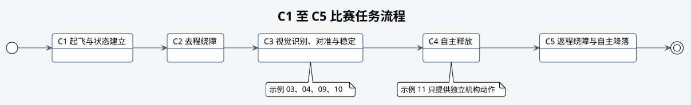

# 规则与示例的对应关系

## 规则来源

本章依据 2026 年 8 月 12 日《ROBOTAC AIROBOTIC 总决赛 C 组无人机竞赛规则》整理，
这里只说明各项比赛要求可以参考哪些示例，不复制完整规则。

当前示例采用以下公开参数：

- AprilTag 编码族：`Tag36h11`
- AprilTag ID：`0`
- 黑色编码区域边长：`0.15 m`
- 视觉输出：目标位置或中心偏差
- 对准稳定时间：默认 3 秒

正式比赛须以组委会最新规则、修订通知和技术公报为准。

## C1 至 C5 对应关系

| 评分项 | 规则要求 | 可参考示例 | 本 Repo 没有包含的内容 |
| --- | --- | --- | --- |
| C1 | 自主解锁起飞，在几何中心距地面 `1.00–2.00 m` 范围内稳定保持不少于 3 秒 | 01、02、05、06 | 比赛现场高度复核和完整判定记录 |
| C2 | 去程自主飞行并从固定障碍侧面绕行 | 07、08 | 障碍路线、净空策略和越界判定 |
| C3 | 识别固定目标，依据视觉结果自主对准，并稳定悬停不少于 3 秒 | 03、04、09、10 | 现场显示、最终阈值和赛场外参 |
| C4 | 程序自主释放并形成有效落点 | 11 | 与飞行联动、落点预测和释放时机 |
| C5 | 再次绕障、返回起降台并自主降落 | 06、07、08 | 返程障碍路线和圆桌降落精度 |

示例 08 的 YAML 只包含短距离教学航点，不是比赛路线。示例 11 不与飞行示例联动。参赛选手
应分别验证各个接口，再自行安排队伍的任务流程。

## 比赛流程

该图表示规则中的任务顺序，参赛选手可以据此组合各个示例并安排队伍程序。

## 参赛选手需要自行完成的内容

### 路线与障碍

根据正式场地图、飞机外形、保护结构、定位误差和安全净空设计去程与返程路线。禁止把示例
位移量直接解释为比赛航点。

### 任务安排

队伍程序应写清每一步何时开始、何时完成、超时后如何处理，以及如何中止和人工接管。
比赛允许的启动次数、两次飞行的连续计时和成绩计算应直接依据正式规则，不能使用示例默认值。

### 视觉结果记录

规则要求能够查看识别结果。队伍程序至少应记录本次飞行是否识别到目标，以及目标位置或
中心偏差。仅到达预设坐标不能替代视觉识别和自主对准。

### 投放与降落

舵机串口成功只证明控制帧完成写入。货物是否完全脱离、落点是否有效、降落投影是否进入
对应区域，都需要另行设计记录方式和现场判定方法。

## 比赛前需要核对的参数

- 使用当前正式规则版本。
- 核对有效飞行区、障碍尺寸、桌面位置和禁止越障条件。
- 核对起飞高度、稳定时间、总计时和飞行次数。
- 核对 Tag 家族、ID、黑色编码边长和贴纸方向。
- 核对模拟货物、投放机构和落点判定方式。
- 核对人工接管、急停、越界和严重违规条件。
- 用本队登记飞机重新完成标定，并按步骤重新检查。
