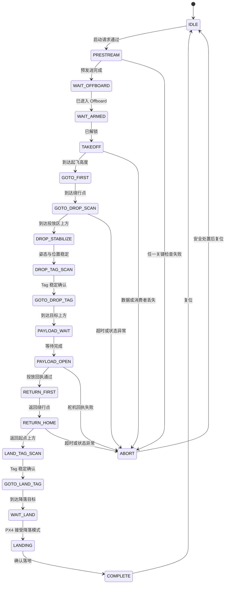

# 竞赛任务

## 任务定位

`tag_payload_mission.py` 实现 C 组无人机任务的软件闭环：建立本地任务坐标系、起飞、经过
中间点绕行、寻找投放区 Tag、对准并释放模拟货物、沿原路线返航、寻找降落区 Tag，最终
由 PX4 执行降落。

该实现属于历史开发基线，不构成组委会正式规则的程序化副本。执行前必须完成本章末尾的
规则适配清单。

## 任务坐标系

调用任务启动服务并被节点接受时，程序以当时的位置和航向建立任务帧：

- `+x`：机头前方。
- `+y`：机体右侧。
- `+z`：上方。

`first_point`、`drop_scan_point`、`return_first_point` 和 `home_point` 均以该启动时刻
为基准。飞机摆放方向或起点变化将改变航线在场地中的实际方向。

## 任务状态机

图中为主要路径。运行期间，所有活动状态均持续检查 MAVROS 连接、本地位置新鲜度、位置
跳变、任务总时限和控制输出条件。异常可能直接进入 `ABORT`。

## 分阶段流程

### 1. 启动前

节点加载 `config/deployment.yaml` 和 `config/flight/tag_payload_mission.yaml`，但默认仅提供
预览。现场负责人必须确认版本、标定、PX4 保护、人员隔离和当前规则参数。

### 2. 启动、Offboard 与解锁

启动请求通过后，程序记录起点姿态，完成设定点预发送，再按显式启用项请求 Offboard 和解锁。
任一自动动作未启用、状态超时或消费者不存在时，请求应被拒绝或任务中止。

### 3. 起飞与绕障

飞机升至 `takeoff_height`，依次前往 `first_point` 和 `drop_scan_point`。当前路线中的中间点
用于形成绕行轨迹。现场障碍净空须依据最新场地图、机体外形和定位误差重新计算。

### 4. 识别与投放

到达扫描点并完成稳定后，程序从 `/tag_detections` 选择目标编号。Tag 必须满足连续样本、跳变和
数据年龄阈值，并通过 TF 转到本地位置帧。到达确认位置后等待，发布舵机开启指令，并要求
`/robotac_servo/status` 返回成功写入状态。

回执不构成机械投放成功证明。地面和受控实飞还须独立观察货舱动作和落点结果。

### 5. 返航与降落

任务沿 `return_first_point` 返回 `home_point`，再次确认降落目标。接近目标后请求配置的
`AUTO.LAND`，持续观察落地状态，最终进入 `COMPLETE`。

## 启动、中止与复位方法

任务节点公开三个 `std_srvs/Trigger` 服务：

- 启动：`/robotac/tag_payload_mission/start`
- 中止：`/robotac/tag_payload_mission/abort`
- 复位：`/robotac/tag_payload_mission/reset`

服务调用须纳入具备人员确认和状态回读的操作流程：

1. 现场负责人完成对应验证等级的检查并授权。
2. 操作员确认 `/robotac/tag_payload_mission/status`、`active` 和 `route_manifest`。
3. 受审计的上位机或现场终端调用启动服务，并检查 `success` 与返回原因。
4. 发现偏航、定位异常、越界风险或人员侵入时，按现场预案中止并由遥控手接管。
5. 只有任务已处于安全终态、飞机已安全落地并完成原因记录后才复位。

启动服务无法绕过节点门禁；中止不得替代 PX4 失联保护和遥控接管。参赛选手不得在无人监管
条件下自动循环调用启动或复位服务。

## 运行监控输出

| 输出 | 用途 |
| --- | --- |
| `/robotac/tag_payload_mission/status` | 当前状态、拒绝或中止原因 |
| `/robotac/tag_payload_mission/active` | 任务活动状态 |
| `/robotac/tag_payload_mission/route_manifest` | 固化本次加载的航线和关键参数 |
| `/robotac/tag_payload_mission/confirmed_tag_pose` | 核对稳定 Tag 的位置和帧 |
| `/robotac/tag_payload_mission/setpoint_preview` | 在不输出控制时检查目标轨迹 |

证据记录必须包含上述输出、Git SHA、配置快照和现场条件，不得以单段飞行视频替代。

## 规则适配清单

下表对比当前仓库历史示例与已知规则要求。正式执行前仍须以组委会最新文件复核。

| 检查项 | 当前历史示例 | 适配要求 |
| --- | --- | --- |
| 投放区 Tag | `drop_tag_id: 1` | 当前规则两张任务桌均使用 ID 0，必须按最新文件修订并现场验证 |
| 降落区 Tag | `land_tag_id: 0` | 与实际打印、尺寸和命名逐项核对 |
| 横向绕行点 | `first_point.y: 2.0 m` | 位于 4 m 宽场地边界，必须计入机体半径和定位误差后内收 |
| 稳定时间 | `hold_seconds: 1.0` | 当前规则要求稳定至少 3 秒，示例值不得沿用 |
| 投放前等待 | `payload_wait_seconds: 1.0` | 须明确该参数与规则稳定判定是否叠加，不得自行缩短 |
| 任务总超时 | `mission_timeout: 600.0` | 当前规则两次机会共用 6 分钟，单次程序 10 分钟超时不符合计时边界 |
| Tag 对准跳过项 | `skip_tag_alignment` 默认关闭但代码支持 | 仅可用于隔离测试；跳过视觉对准不符合合规得分流程 |
| 起飞与飞越高度 | 0.30 m 历史值 | 结合规则、障碍尺寸、下洗、定位噪声和安全净空重新确定 |
| Tag 尺寸 | 配置中有历史尺寸 | 同时核对黑色编码边长、打印总尺寸和检测器定义 |
| 航线方向 | 由启动机头方向决定 | 须按现场起点朝向和障碍布局验证，不得仅依据 YAML 数值 |

## 正式参数冻结流程

1. 获取并标注组委会最新正式规则和技术通知版本。
2. 从场地尺寸、障碍和评分条件推导路线边界，不从历史 YAML 反推规则。
3. 核对 Tag 编号、实体尺寸、安装姿态和相机检测配置。
4. 在离线预览和仿真中验证状态流、时间预算、失败分支和投放序列。
5. 完成只读实机观察和地面联调，再按 [安全与验证](06-safety-and-validation.md) 进入受控实飞。
6. 冻结 Git SHA、配置文件校验值、PX4 参数快照和现场检查表。

## 当前证据边界

任务状态流转、航点、投放指令和多类异常门禁已有硬件隔离仿真覆盖。现有证据不足以声明：

- 已完成当前正式赛道的完整自主实飞。
- 投放机构具备可重复的落点精度。
- 历史配置已满足最终规则。
- 仿真中的 Tag、动力学、时延和误差代表真实现场。

[返回文档索引](README.md)
