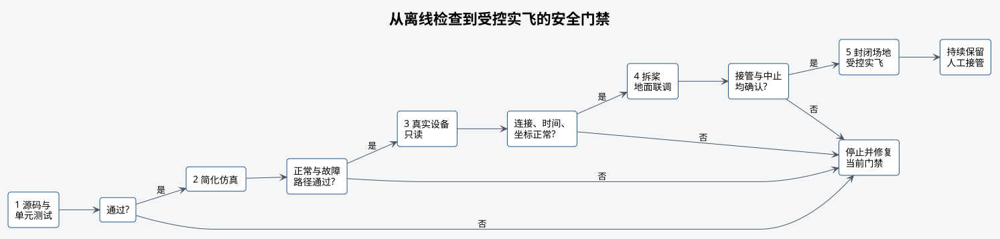

# 安全与验证



## 基本要求

检查必须按顺序完成。源码没有错误、构建成功、仿真通过或真实设备有数据，均不能单独证明
飞机可以安全实飞。

## 五个步骤

| 步骤 | 环境 | 允许操作 | 通过条件 |
| --- | --- | --- | --- |
| 1 源码与单元 | 开发机 | 静态检查、纯函数测试 | 语法、接口、行数、解析和单元测试通过 |
| 2 简化仿真 | 隔离 ROS master | 假飞控、假 Tag、设定点和服务 | 默认无动作，正常与故障路径符合预期 |
| 3 真实设备只读 | 飞机上电、桨叶拆除 | 读取设备与 ROS 数据 | 连接、频率、时间、坐标和状态均正常 |
| 4 地面联调 | 飞机固定、桨叶拆除 | 检查服务、模式和舵机台架 | 逐项确认程序会拒绝异常请求，并检查接管和机械动作 |
| 5 受控实飞 | 封闭场地 | 单项低风险飞行 | 安全负责人批准，操作员全程可接管 |

不要跳过前面的步骤直接进行受控实飞。投放机构台架检查和飞行检查必须分别进行，不自动串联。

## 离线检查

```bash
# 检查源码、配置、接口和文档链接。
./tools/test_01_source.sh
# 执行 catkin 构建。
./tools/test_02_build.sh
# 运行纯单元测试。
./tools/test_03_unit.sh
# 运行假飞控仿真。
./tools/test_04_simulation.sh
```

假飞控仿真覆盖：

- launch 默认启动无动作；
- 非落地状态和本地位置过期拒绝启动；
- 悬停、相对位移和 YAML 航点；
- Tag 对准成功与 Tag 丢失；
- 操作员停止、定位故障和目标越界后请求降落；
- 节点只允许执行一次。

简化仿真不证明 PX4 动力响应、真实 estimator、实际 TF、网络可靠性或比赛精度。

## 只读实机

```bash
# 读取真实设备和 ROS 数据，不发送控制命令。
./tools/test_05_hardware_readonly.sh
```

脚本只检查设备文件并读取单条 ROS 消息，不发布设定点，不调用模式、解锁或舵机服务。通过后
仍需人工检查数据频率、漂移、坐标方向、时间同步和 PX4 参数。

## 飞行示例启动前的检查

`06`、`07`、`08` 和 `10` 在接受 `~start` 前检查：

- FCU 已连接，并且状态消息在规定时间内持续更新；
- 飞机未解锁并处于落地状态；
- 本地位置未过期；
- 外部视觉状态消息在规定时间内持续更新，且状态正常；
- estimator 姿态、水平相对位置与垂直位置有效；
- timesync 状态未过期且往返延迟在限制内；
- MAVROS 已订阅位置设定点。

这些检查通过，只表示程序收到的状态符合要求。是否可以起飞，仍由现场负责人根据场地和
飞机的实际情况决定。

## 飞行中出现故障时

发生下列情况后，示例不再更新飞行目标，并请求 `AUTO.LAND`：

- `~stop` 被调用；
- FCU、位置、外部视觉、estimator 或 timesync 数据过期；
- FCU 断开或外部视觉状态异常；
- OFFBOARD 模式丢失；
- MAVROS 设定点订阅中断；
- Tag 对准期间检测超时；
- 目标包含无效数值或超出程序设置的范围。

软件降落请求可能失败。安全操作员必须能够立即人工接管。

## 如何说明检查结果

| 项目 | 可以通过本 Repo 的离线测试确认 | 必须在现场确认 |
| --- | --- | --- |
| 源码和配置结构 | 是 | 否 |
| 纯计算与协议 | 是 | 否 |
| 示例状态变化和故障时的降落请求 | 是 | PX4 是否实际执行 |
| MID360、相机、MAVROS 数据存在 | 否 | 是 |
| 外部视觉可用于受控飞行 | 否 | 是 |
| 完整赛道、重复投放和降落精度 | 否 | 是 |
| 与最终规则完全适配 | 否 | 赛前复核 |

一次测试没有发生事故，不等于安全措施已经经过验证。

## 受控实飞检查

- 封闭场地、净空和边界已经确认。
- 桨叶、保护结构、电池、载荷和重心已经检查。
- 安全操作员持有接管设备并完成接管演练。
- 本次只增加一个未经实飞验证的变量。
- 高度、水平范围、速度和超时采用保守限制。
- 现场负责人明确下达开始和终止指令。
- 结束后确认落地、上锁、停桨并断开动力电源。
