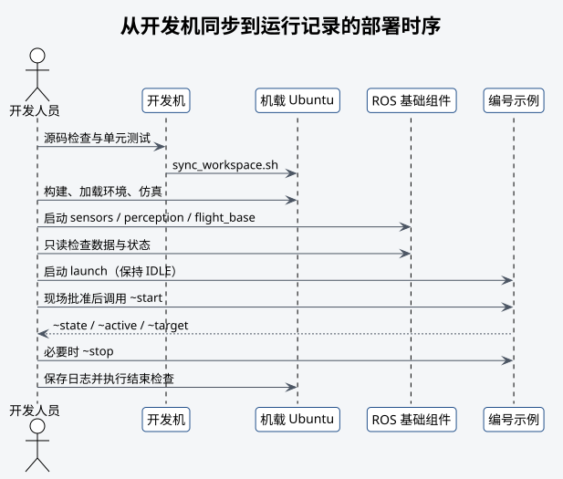

# 部署与运行



## 同步

从开发机同步到机载 Ubuntu 主机：

```bash
# 将工作空间同步到机载 Ubuntu 主机。
./tools/sync_workspace.sh <用户>@<飞机地址>:<工作空间目录>
```

同步脚本排除 `.git`、`build`、`devel`、`install` 和 `log`，也不会删除远端已有的其他文件。
同步前应确认目标目录，避免覆盖其他队伍的文件或系统服务使用的配置。

需要用本地仓库完整替换已确认的机载工作空间时，先预演再执行镜像同步：

```bash
# 预览文件更新、旧源码删除、构建目录清理和环境文件初始化。
./tools/sync_workspace.sh --mirror --dry-run \
  <用户>@<飞机地址>:<工作空间绝对目录>
# 执行完整镜像；该操作会同步 .git 并删除远端多余源码。
./tools/sync_workspace.sh --mirror \
  <用户>@<飞机地址>:<工作空间绝对目录>
```

镜像模式不会上传或删除已有的 `.env`、`.env.local`。仓库只同步 `.env.template`；使用
`--init-env` 或 `--mirror` 时，仅在同目录 `.env` 不存在的情况下从模板初始化，并设置为
`0600`。初始化后的占位值必须在目标主机上核对，不得将真实凭据回传仓库。

## 机载构建

```bash
# 进入机载工作空间。
cd <工作空间目录>
# 检查源码和文档链接。
./tools/test_01_source.sh
# 执行比赛运行构建并检查包发现情况。
./tools/test_02_build.sh
# 加载构建后的 ROS 环境。
source devel/setup.bash
# 运行纯单元测试。
./tools/test_03_unit.sh
# 运行简化仿真。
./tools/test_04_simulation.sh
```

构建和仿真阶段不连接设备，不启动真实硬件 launch。
比赛运行构建使用系统 MAVROS 和 AprilTag ROS。只有验证第三方源码时才执行
`./tools/build_full.sh`；其环境位于 `devel_full/setup.bash`，不得替代日常比赛环境。

## 单独验证传感器

首次配置或排障时，先分别启动需要检查的组件。雷达终端执行：

```bash
# 发现并比较现场地址；需要时按提示确认写入配置。
./tools/sensor_setup.py lidar --interface <雷达网卡>
# 只启动 Livox 驱动，不启动相机或 FAST-LIO。
roslaunch robotac_bringup lidar_mid360s.launch
```

在另一个已加载工作空间环境的终端检查：

```bash
# 确认 FAST-LIO 所需的自定义点云类型。
rostopic type /livox/lidar
# 分别观察点云与 IMU 接收频率。
rostopic hz /livox/lidar
rostopic hz /livox/imu
# 读取一帧 IMU，检查时间戳和 frame。
rostopic echo -n 1 /livox/imu
```

`/livox/lidar` 必须为 `livox_ros_driver2/CustomMsg`，`/livox/imu` 必须为
`sensor_msgs/Imu`。两者稳定后才能启动 FAST-LIO。

相机终端执行：

```bash
# 确认采集节点、目标模式和稳定别名。
./tools/sensor_setup.py camera
# 只启动 RGB 相机。
roslaunch robotac_bringup camera_rgb.launch
```

另一个终端检查 `/camera/rgb/image_raw` 和 `/camera/rgb/camera_info` 的类型、频率、
`frame_id`、宽高以及标定尺寸。不要把相机 metadata 节点传给 `video_device`。

## 启动基础组件

分别在已加载工作空间环境的终端启动：

```bash
# 启动 MID360 和 RGB 相机。
roslaunch robotac_bringup sensors.launch
# 启动 FAST-LIO 和 AprilTag。
roslaunch robotac_bringup perception.launch
# 启动 MAVROS 和外部视觉输出。
roslaunch robotac_bringup flight_base.launch
```

排障时只启动对应的组件 launch。不要用多个终端重复启动同一设备节点。
`sensors.launch` 会同时启动 MID360 和 RGB 相机；它不负责发现地址或安装 udev 规则。

## 只读检查

基础组件全部启动后执行：

```bash
# 读取真实设备和 ROS 数据，不发送控制命令。
./tools/test_05_hardware_readonly.sh
```

随后人工检查：

```bash
# 查看 FAST-LIO 里程计频率。
rostopic hz /sunray/odometry
# 查看 MAVROS 本地位姿频率。
rostopic hz /mavros/local_position/pose
# 读取外部视觉桥接状态。
rostopic echo -n 1 /vision_pose_bridge/state
# 读取飞控连接状态。
rostopic echo -n 1 /mavros/state
```

只读检查不得调用飞控服务。

## 示例运行

以悬停示例为例：

```bash
# 启动定高悬停示例；此时不会自动起飞。
roslaunch robotac_examples 06_hover.launch
```

launch 启动后保持 `IDLE`。现场检查完成并获得开始指令后，另行调用：

```bash
# 请求悬停示例开始执行。
rosservice call /robotac_examples/hover/start "{}"
```

需要中止时：

```bash
# 请求当前示例中止并降落。
rosservice call /robotac_examples/hover/stop "{}"
```

每次节点只执行一次。结束后重新启动 launch 才能进行下一次测试。

## 运行记录

每次会控制飞机或投放机构的测试至少记录：

- Git 提交 SHA 和使用的配置文件；
- 飞机编号、测试日期、场地和安全负责人；
- launch 参数、`~state`、`~active` 和 `~target`；
- FCU 模式、解锁、落地、estimator 和 timesync 状态；
- 中止、人工接管和异常原因；
- 本次结果，以及下一次准备增加的测试内容。

公开材料应删除机器地址、个人路径和凭据。

## 比赛前检查

- 代码与配置和预审提交版本一致，变更已有记录。
- 指定飞机、投放机构、模拟货物和电池通过检录。
- 传感器、外部视觉和本地位置稳定。
- Tag ID、尺寸、贴纸方向和相机外参已复核。
- 障碍路线、边界、计时和中止条件使用当前规则。
- 遥控器接管和急停方式已经确认，安全操作员已经确定。
- 两次飞行共用计时的操作流程已经演练。

## 结束检查

1. 确认飞机落地、上锁、停桨。
2. 断开动力电池，再处理 USB 和载荷。
3. 正常结束示例、bringup 和记录进程。
4. 用 `rosnode list` 核对没有重复或残留节点。
5. 保存日志和配置快照，记录异常。

不得依据旧进程编号直接终止进程，也不得用宽泛进程名清理无关 ROS 节点。
