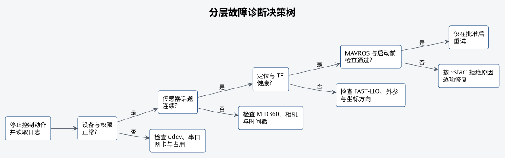

# 故障排查



## 串口权限或设备名变化

现象：PX4 或舵机节点无法打开设备。

1. 使用 `ls -l <串口设备>` 检查设备是否存在。
2. 使用 `udevadm info --query=all --name=<串口设备>` 核对设备属性。
3. 检查当前用户所属设备访问组和 udev 规则。
4. 确认没有其他进程占用串口。

不得通过长期使用 root 运行整套工作空间解决权限问题。

## MID360 无数据

检查 `mid360s.json` 中的主机和雷达地址、网卡状态、专用子网、驱动日志以及 Livox 数据端口。
公开排障记录应使用 `<机载网卡地址>` 和 `<雷达地址>`，不记录实际值。

只有点云没有 IMU 时，FAST-LIO 仍不能正常工作。分别检查点云和 IMU 频率、时间戳和 frame。

## MAVROS 未连接

检查：

- `<飞控设备>` 是否存在且未被占用；
- `fcu_url` 的设备名和波特率；
- PX4 是否正常启动；
- MAVROS 心跳超时日志；
- udev 稳定别名是否匹配目标飞控。

MAVROS 显示连接成功，只表示已经收到飞控心跳。还需要单独检查 estimator 和 OFFBOARD
所需的状态。

## FAST-LIO 无里程计

按输入顺序检查：

1. Livox 点云与 IMU 均有数据；
2. 话题名和消息类型符合 `mid360s.yaml`；
3. 雷达类型、外参和时间同步配置正确；
4. FAST-LIO 日志没有初始化失败或时间回退；
5. `/sunray/odometry` 的时间戳、姿态和频率连续。

## 外部视觉被拒绝

读取：

```bash
# 读取外部视觉桥接的当前状态。
rostopic echo -n 1 /vision_pose_bridge/state
# 读取外部视觉是否健康。
rostopic echo -n 1 /vision_pose_bridge/healthy
```

状态含义：

| 状态 | 检查项 |
| --- | --- |
| `WAITING` | 尚未收到里程计 |
| `STAMP` | 时间戳为空、过旧或超前 |
| `FRAME` | 输入 frame 与配置要求不一致 |
| `NONFINITE` | 位姿含 NaN 或无穷值 |
| `QUATERNION` | 四元数未归一化 |
| `RADIUS` | 位置超出配置范围 |
| `ORDER` | 时间戳未递增 |
| `SPEED` | 相邻位姿推算速度过大 |
| `TIMEOUT` | 输入数据中断 |

先修正数据源或标定，不应扩大阈值掩盖问题。

## TF 缺失或方向错误

AprilTag 本地坐标需要 `map` 到相机光学坐标系的完整 TF。检查 frame 名、父子关系、时间戳
和外参数值。零外参只可用于明确的测试模型，不得直接用于真实飞机。

## AprilTag 无检测

检查：

- 图像与 `camera_info` 的分辨率和时间戳；
- Tag 家族是否为 `tag36h11`；
- 实体是否为 ID 0，黑色编码区域边长是否按 `0.15 m` 配置；
- 曝光、焦距、运动模糊、打印质量和遮挡；
- `/tag_detections` 是否有数据。

有检测但位置跳变时，检查相机内参、Tag 尺寸和光学坐标方向。

## 飞行示例拒绝启动

`~start` 会说明拒绝启动的原因。常见原因包括未落地、位置过期、外部视觉异常、estimator
无效、timesync 延迟过大或 MAVROS 没有订阅位置设定点。

逐项排除问题后再调用。启动失败不会跳过后续检查；节点已经执行过一次时必须重新启动。

## 运行中进入 `ABORT`

读取示例日志、`~state` 和 FCU 状态。确认是否由 `~stop`、数据断流、模式丢失、Tag 超时或
目标越界触发。软件已经请求降落时仍须观察实际飞机并准备人工接管。

## 舵机无响应

检查 `<舵机设备>`、供电、串口占用、波特率、控制器协议、软件限位和机构卡滞。状态话题只能
确认驱动程序的状态，不能确认货物是否已经脱离。禁止连续调用服务，强行驱动已经卡住的机构。

标定流程见[舵机投放机构标定](10-servo-release-calibration.md)。
