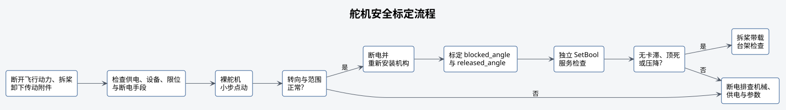

# 舵机投放机构标定



## 适用范围

本流程用于地面标定阻挡位置和释放位置。标定期间禁止安装桨叶、挂载模拟货物或启动飞行
示例。机构应固定在独立台架，避免舵机突然动作造成夹伤或结构损坏。

调试舵机前，必须先断电并拆下舵机输出轴上的舵盘、齿轮、连杆、挂钩和其他旋转附件。
通过齿轮咬合、卡扣或其他方式固定在旋转装置上的部件，也必须全部卸下。确认输出轴周围
没有会被带动的配件后，再接通控制器进行调试。

## 前置检查

- 飞行动力电池已断开。
- 桨叶已经拆除。
- 投放机构没有挂载货物。
- 舵机输出轴上的舵盘、齿轮、连杆、挂钩和其他旋转附件已经全部拆下。
- 重新装回机构后，连杆、挂钩和限位可以由人工缓慢移动。
- 舵机电源电压、电流能力和地线连接符合硬件要求。
- `<舵机设备>` 对应目标 USB 控制器，且未被其他进程占用。
- 现场有独立断电手段。

## 配置参数

文件：`src/robotac_servo/config/servo.yaml`

| 参数 | 含义 |
| --- | --- |
| `channel` | 控制器通道 |
| `frequency_hz` | PWM 频率 |
| `pwm_min_duty`、`pwm_max_duty` | 角度换算使用的占空比范围 |
| `min_command_angle`、`max_command_angle` | 软件允许的角度范围 |
| `blocked_angle` | 阻挡位置的逻辑角度 |
| `released_angle` | 释放位置的逻辑角度 |
| `drive_seconds` | 每次动作保持时间 |
| `idle_duty` | 动作完成后的空闲占空比 |

逻辑角度用于换算整数占空比，不是舵机角度传感器读数。

当前飞机的现场标定默认值为：`blocked_angle: 0.0`（阻挡位置）、
`released_angle: 45.0`（彻底释放位置），对应当前默认 PWM 参数下的整数占空比分别为 `3` 和
`5`。这些数值只适用于当前装配状态；更换舵机、舵盘、连杆或重新安装铁丝后，必须按本流程
重新标定并更新配置，不能直接沿用。

## 点动工具

```bash
# 加载工作空间环境。
source devel/setup.bash
# 启动 ROS Master 和裸舵机交互标定工具。
roslaunch robotac_servo servo_angle_tuner.launch
```

这是裸舵机点动的推荐命令。点动阶段不得安装舵盘、齿轮、连杆、挂钩或其他旋转附件。工具
会自动尝试 `/dev/robotac_servo`、`/dev/ttyUSB0` 和 `/dev/ttyUSB1`。安全提示输入 `YES` 或
`Y` 后进入界面；连接成功后仍不会自动发送角度，必须按方向键或 `r` 才会点动。

方向键上、下每次调整 1 度，PageUp、PageDown 每次调整 10 度；方向键左、右调整单次点动
时间。界面实时显示目标角度、最后发送角度、整数占空比、脉宽和 PWM 输出状态。按 `c` 标记
阻挡位置，按 `o` 标记释放位置，按空格立即释放 PWM，按 `q` 释放 PWM 并退出。

执行前仍须核对设备、角度、通道、频率、占空比范围和软件限位。每次只调整一个小步长，
动作后观察输出轴是否卡滞、顶死、回弹或持续受力。

确认裸舵机的转向和角度范围后，先断电，再按机构装配要求装回需要使用的舵盘、齿轮、连杆
和挂钩。装回后才能继续标定阻挡位置和释放位置；重新装配时仍要保留机械限位余量。

## 标定阻挡位置

1. 从机构机械中位附近开始。
2. 小步移动到能够可靠承载挂件、但不压迫机械限位的位置。
3. 记录逻辑角度、换算占空比、脉宽和原始控制帧。
4. 断电后人工检查挂钩仍能正常装配和退出。
5. 将结果写入 `blocked_angle`。

阻挡位置不应依靠舵机持续堵转保持。

## 标定释放位置

1. 在不挂载货物的条件下，小步移动到挂钩通道完全打开的位置。
2. 保留机械余量，不得让舵盘或连杆顶住硬限位。
3. 记录与阻挡位置相同的参数。
4. 将结果写入 `released_angle`。
5. 确认两位置换算后的整数占空比不同。

## 独立服务检查

启动驱动：

```bash
# 启动舵机驱动节点。
roslaunch robotac_servo servo.launch port:=<舵机设备>
```

启动过程不应产生机械动作。读取状态：

```bash
# 读取舵机串口连接状态。
rostopic echo -n 1 /robotac_servo/connected
# 读取舵机当前状态。
rostopic echo -n 1 /robotac_servo/state
```

在现场负责人确认后，分别调用阻挡和释放：

```bash
# 请求舵机回到阻挡位置。
rosservice call /robotac_servo/set_released "data: false"
# 请求舵机转到释放位置。
rosservice call /robotac_servo/set_released "data: true"
```

重复动作默认被拒绝。串口断线重连后不会重放上一条命令。

## 带载台架检查

带载检查仍在拆桨台架进行，且不得与飞行示例联动。至少确认：

- 阻挡位置能够承受规定载荷；
- 释放位置使载荷完全脱离；
- 动作时间和供电压降可接受；
- 多次动作没有卡滞、松动或异常温升；
- 断电和节点退出不会产生非预期动作。

通过台架检查不表示投放落点精度已经验证。

## 记录

标定记录应包含飞机编号、机构版本、舵机与控制器型号、供电条件、配置提交 SHA、两位置的
逻辑角度、占空比、脉宽、控制帧和检查结论。公开材料应删除设备地址和个人路径。
