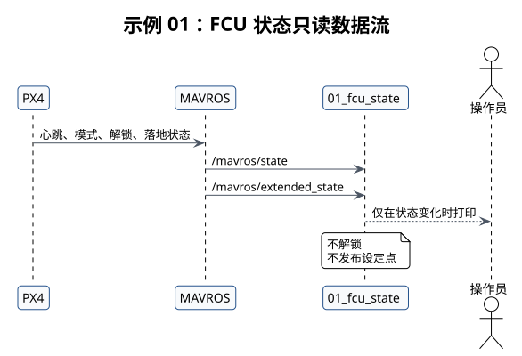

# 示例 01：FCU 状态



## 本教程的作用

只读确认 MAVROS 与 PX4 的连接、模式、解锁状态和落地状态。

## 开始前确认

- 已完成 catkin 构建并加载 `devel/setup.bash`。
- MAVROS 已启动。
- 本示例不要求解锁，不发布设定点。

## 启动命令

```bash
# 启动 FCU 状态只读示例。
roslaunch robotac_examples 01_fcu_state.launch
```

## 正常结果

终端在状态变化时显示 FCU 是否连接、当前模式、是否解锁和落地状态编号。检查期间飞机应保持
上锁和落地。

## 需要停止并检查的情况

- 长时间没有日志：检查 `/mavros/state` 和 `/mavros/extended_state`。
- `connected` 为假：按[MAVROS 故障排查](../08-troubleshooting.md)检查串口和心跳。
- 未经操作却显示已解锁或非落地：停止后续步骤，检查实际飞机状态。

## 下一步

连接和落地状态正常后进入[示例 02](02-local-pose.md)。
