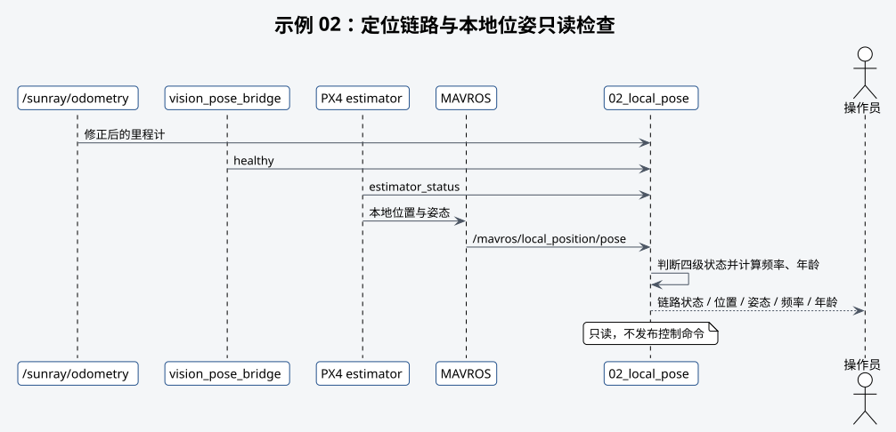

# 示例 02：本地位姿



## 目的

只读检查 MAVROS 本地位置、姿态、接收频率和消息年龄。

## 前置条件

- 示例 01 已确认 FCU 连接正常。
- PX4 estimator 已产生本地位置。
- 飞机保持上锁并固定。

## 启动命令

```bash
# 启动本地位姿只读示例。
roslaunch robotac_examples 02_local_pose.launch
```

## 预期输出

终端周期显示 `x`、`y`、`z`、姿态、接收频率和数据年龄。静止时数据应连续，方向应符合
本机坐标标定。

## 失败判断

- 没有输出：`/mavros/local_position/pose` 无数据。
- 数据年龄持续增加：上游时间戳或通信异常。
- 静止漂移、跳变或轴向相反：不得进入飞行示例，先检查定位和坐标系。

## 下一步

本地位姿稳定后进入[示例 03](03-apriltag-detection.md)。
