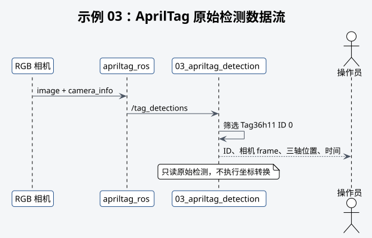

# 示例 03：AprilTag 原始检测



## 目的

显示检测到的 Tag ID、相机坐标系位置和检测消息时间。

## 前置条件

- RGB 相机和 `apriltag_ros` 已启动。
- 使用 `Tag36h11 ID 0` 测试标志。
- 黑色编码区域边长按 `0.15 m` 配置。

## 启动命令

```bash
# 启动 AprilTag 原始检测示例。
roslaunch robotac_examples 03_apriltag_detection.launch
```

## 预期输出

Tag 进入画面后，终端显示 ID、相机 frame、三轴位置和检测时间。移动 Tag 时位置变化方向应
符合相机光学坐标定义。

## 失败判断

- 始终无检测：检查图像、相机内参、Tag 家族、ID、尺寸、曝光和打印质量。
- ID 不为 0：确认测试标志和检测器配置。
- 距离明显失真：优先检查内参和 Tag 黑色编码边长。

## 下一步

原始检测可靠后进入[示例 04](04-apriltag-local-pose.md)。
