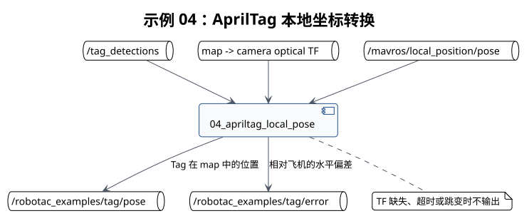

# 示例 04：AprilTag 本地位姿



## 目的

将 ID 0 检测从相机坐标系转换到 `map`，发布目标位置和相对飞机的水平偏差。

## 前置条件

- 示例 02 和 03 已通过。
- `map` 到相机光学 frame 的 TF 完整且已标定。
- `/mavros/local_position/pose` 有连续数据。

## 启动命令

```bash
# 启动 AprilTag 本地位姿转换示例。
roslaunch robotac_examples 04_apriltag_local_pose.launch tag_id:=0
```

## 预期输出

```bash
# 查看 Tag 在 map 中的位置。
rostopic echo /robotac_examples/tag/pose
# 查看 Tag 相对飞机的水平偏差。
rostopic echo /robotac_examples/tag/error
```

`pose` 为 Tag 在 `map` 中的位置，`error.x` 和 `error.y` 为 Tag 相对飞机的水平偏差。

## 失败判断

- 日志提示无法转换：TF 缺失、时间不同步或 frame 名不一致。
- 输出间歇消失：稳定样本不足或位置跳变超过限制。
- 偏差方向与实际相反：相机外参或坐标轴定义错误。

## 下一步

转换方向确认后进入[示例 05](05-setpoint-preview.md)。
