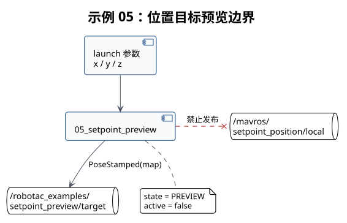

# 示例 05：位置目标预览



## 本教程的作用

生成一个 `PoseStamped` 目标，说明位置设定点结构，但不向 MAVROS 发布。

## 开始前确认

- 已加载工作空间环境。
- 不需要连接飞控、定位或传感器。

## 启动命令

```bash
# 生成一个位置目标预览，不向 MAVROS 发布。
roslaunch robotac_examples 05_setpoint_preview.launch x:=0.5 y:=0.0 z:=0.6
```

## 正常结果

```bash
# 查看位置目标预览。
rostopic echo /robotac_examples/setpoint_preview/target
```

目标 frame 为 `map`。`active` 保持为假，`state` 为 `PREVIEW`。MAVROS 位置设定点话题不应
出现本节点的发布者。

## 需要停止并检查的情况

- `~target` 无数据：检查节点和命名空间。
- 数值与 launch 参数不一致：停止并检查参数覆盖来源。
- 节点出现在 MAVROS 设定点发布者列表：视为接口错误，不得继续。

## 下一步

先完成假飞控仿真和地面检查，再按批准流程进入[示例 06](06-hover.md)。
