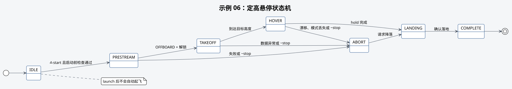

# 示例 06：定高悬停



## 本教程的作用

从地面请求 OFFBOARD、解锁、定高悬停，并在保持结束后请求降落。

## 开始前确认

- 已完成安全检查的前四个步骤。
- 定位链路已按下述顺序启动，并通过示例 02 检查。
- 飞机上锁、落地，场地封闭，安全操作员可接管。
- 高度和水平移动范围已经按本次场地复核。

## 定位启动顺序

悬停通过位置目标保持高度和水平位置，因此需要连续的激光里程计和 PX4 融合结果。分别在
三个已加载工作空间环境的终端执行：

```bash
# 启动 MID360 和 RGB 相机，只产生传感器数据。
roslaunch robotac_bringup sensors.launch
# 保持飞机静止，启动 FAST-LIO 和里程计修正。
roslaunch robotac_bringup perception.launch
# 启动 MAVROS，并将修正后的里程计送入 PX4。
roslaunch robotac_bringup flight_base.launch
```

以上 launch 不会控制飞机。随后执行：

```bash
# 只读检查完整定位链路和最终本地位姿。
roslaunch robotac_examples 02_local_pose.launch
```

确认四项状态正常，并完成静止漂移、手动平移、轴向和航向检查。任一话题中断、位置跳变、
方向相反或消息过期时，不得继续。本示例 launch 不会自动启动上述基础组件。

## 启动命令

```bash
# 启动定高悬停示例；此时不会自动起飞。
roslaunch robotac_examples 06_hover.launch height:=0.6 hold:=3.0
```

launch 启动后应保持 `IDLE`。现场负责人批准后执行：

```bash
# 请求示例开始起飞和悬停。
rosservice call /robotac_examples/hover/start "{}"
```

中止：

```bash
# 请求示例中止并降落。
rosservice call /robotac_examples/hover/stop "{}"
```

## 正常结果

`~state` 依次进入 `PRESTREAM`、`TAKEOFF`、`HOVER`、`LANDING`、`COMPLETE`。`~active`
仅在任务执行期间为真。

## 需要停止并检查的情况

- `~start` 拒绝：按返回原因检查落地、位置、外部视觉、estimator、timesync 或订阅关系。
- FAST-LIO 有数据但本地位姿异常：检查外部视觉转发和 PX4 融合，不能直接开始悬停。
- 状态进入 `ABORT`：确认实际飞机是否执行降落，准备人工接管。
- 高度、姿态或水平漂移异常：立即中止或接管，不得修改阈值后直接重试。

## 下一步

悬停可重复验证后进入[示例 07](07-move-relative.md)。
