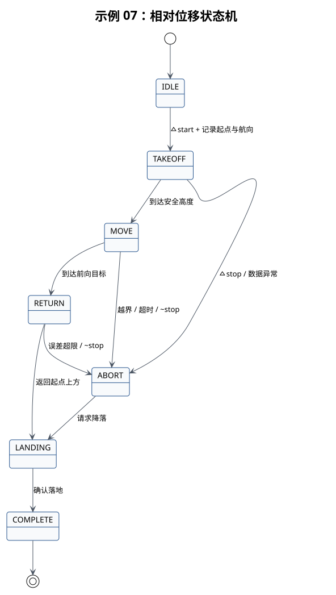

# 示例 07：相对位移



## 本教程的作用

起飞后沿起始航向前方完成一次相对位移，返回起点上方并降落。

## 开始前确认

- 示例 06 已在同一飞机和场地通过。
- 前向距离、高度和移动范围已复核。
- 航线及周围净空满足人工接管条件。

## 启动命令

```bash
# 启动相对位移示例；此时不会自动起飞。
roslaunch robotac_examples 07_move_relative.launch height:=0.6 forward:=0.5
# 请求示例开始执行相对位移。
rosservice call /robotac_examples/move_relative/start "{}"
```

中止服务为 `/robotac_examples/move_relative/stop`。

## 正常结果

状态经过 `TAKEOFF`、`MOVE`、`RETURN`、`LANDING` 和 `COMPLETE`。目标位置基于节点接受
启动请求时的本地位置和航向计算。

## 需要停止并检查的情况

- 目标超出 `max_xy` 或 `max_z`：节点进入 `ABORT` 并请求降落。
- 运动方向与机头前方不一致：停止测试，检查航向和坐标系。
- 返回误差持续超限：检查定位漂移和控制响应，不进入航点示例。

## 下一步

单次位移方向和返回稳定后进入[示例 08](08-waypoints.md)。
