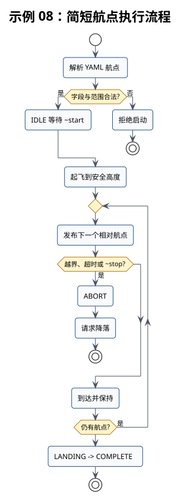

# 示例 08：简短航点



## 本教程的作用

读取 YAML 中的相对航点，按顺序到达并保持，最后请求降落。

## 开始前确认

- 示例 07 已通过。
- 定位链路已重新检查，当前原点、航向和各轴方向正确。
- 航点文件只包含 `x`、`y`、`z`、`hold`。
- 每个航点均在本次场地和程序允许的移动范围内。
- 航点文件用于短距离教学，不涉及场地路线设计。

## 定位启动顺序

YAML 中的每个航点都是相对于接受 `~start` 时的 PX4 本地位置和航向计算的。定位漂移会累积
到每个航点，并影响最后的降落位置。分别在三个终端执行：

```bash
# 启动 MID360 和 RGB 相机，只产生传感器数据。
roslaunch robotac_bringup sensors.launch
# 保持飞机静止，启动 FAST-LIO 和里程计修正。
roslaunch robotac_bringup perception.launch
# 启动 MAVROS，并将修正后的里程计送入 PX4。
roslaunch robotac_bringup flight_base.launch
```

```bash
# 只读检查完整定位链路和最终本地位姿。
roslaunch robotac_examples 02_local_pose.launch
```

四项状态均正常后，再核对静止漂移、轴向、航向和每个航点的实际运动方向。出现跳变、方向
相反或消息过期时不得继续。本示例 launch 不会启动任何基础定位组件。

## 启动命令

```bash
# 启动简短航点示例并指定航点文件。
roslaunch robotac_examples 08_waypoints.launch \
  route_file:=$(rospack find robotac_examples)/config/waypoints.yaml
# 请求示例开始执行航点。
rosservice call /robotac_examples/waypoints/start "{}"
```

中止服务为 `/robotac_examples/waypoints/stop`。

## 正常结果

状态按 `WAYPOINT_1`、`WAYPOINT_2` 等顺序变化，全部完成后进入 `LANDING` 和 `COMPLETE`。
`~target` 可用于记录每个实际发送的目标。目标基于 PX4 融合后的本地位姿计算，不直接基于
`/Odometry` 或 `/sunray/odometry`。

## 需要停止并检查的情况

- YAML 字段缺失、增加未知字段或 `hold` 超限：节点启动失败。
- 目标越界或超时：任务进入 `ABORT` 并请求降落。
- 定位漂移、跳变或消息过期：停止执行，逐级检查里程计、外部视觉转发和 PX4 融合。
- 实际轨迹侵入障碍或边界：立即人工接管，不能依赖软件目标继续飞行。

## 下一步

航点示例只说明顺序执行。比赛路线和异常策略由参赛选手另行设计。视觉部分从
[示例 09](09-tag-centering-preview.md)继续。
