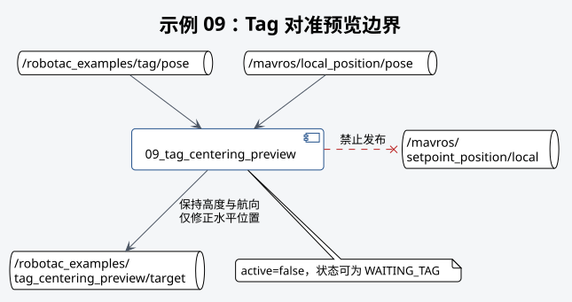

# 示例 09：Tag 对准预览



## 本教程的作用

根据本地 Tag 位置计算水平对准目标，只发布预览，不控制飞机。

## 开始前确认

- 示例 04 已确认 Tag 本地位置和偏差方向正确。
- 本地位姿与 Tag 检测连续。
- 飞机保持上锁或处于安全固定状态。

## 启动命令

```bash
# 启动 Tag 对准预览示例，不控制飞机。
roslaunch robotac_examples 09_tag_centering_preview.launch tag_id:=0
```

## 正常结果

```bash
# 查看视觉对准目标预览。
rostopic echo /robotac_examples/tag_centering_preview/target
# 查看 Tag 相对飞机的水平偏差。
rostopic echo /robotac_examples/tag/error
```

预览目标的水平位置与 Tag 一致，高度和航向保持当前飞机值。`active` 保持为假。

## 需要停止并检查的情况

- 状态长期为 `WAITING_TAG`：检查检测、稳定窗口、本地位姿和 TF。
- 预览修正方向错误：检查外参和偏差定义，不得进入实飞对准。
- 目标出现不连续跳变：检查检测质量和 Tag 尺寸。

## 下一步

在地面移动测试中确认修正方向和幅度后，按受控检查流程进入[示例 10](10-tag-centering-flight.md)。
