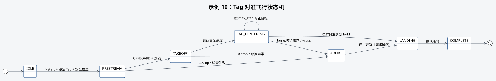

# 示例 10：Tag 对准飞行



## 本教程的作用

从地面起飞，对准 ID 0，在默认 3 秒稳定时间后请求降落。

## 开始前确认

- 示例 06 和 09 均已通过。
- 飞行定位和 AprilTag 检测两条数据链均已重新检查。
- 起飞位置能够稳定检测目标，TF 和相机外参已经现场确认。
- `max_step`、高度、总超时和移动范围采用保守值。
- 场地封闭，安全操作员可随时接管。

## 两条数据链

本示例同时依赖两套数据：

- 飞行定位链：MID360 和 IMU → FAST-LIO → 修正里程计 → PX4 estimator → MAVROS 本地位姿；
- 目标检测链：RGB 图像 → AprilTag 检测 → TF 转换后的 Tag 本地位置。

Tag 只能提供目标位置，不能代替无人机自身的连续位置。FAST-LIO 和 PX4 融合正常但 Tag
检测错误时不能对准；Tag 检测正常但本地位姿无效时也不能飞行。

分别在三个终端建立两条数据链：

```bash
# 启动 MID360 和 RGB 相机，提供定位与识别的原始数据。
roslaunch robotac_bringup sensors.launch
# 保持飞机静止，启动 FAST-LIO、里程计修正和 AprilTag。
roslaunch robotac_bringup perception.launch
# 启动 MAVROS，并将修正后的里程计送入 PX4。
roslaunch robotac_bringup flight_base.launch
```

```bash
# 只读检查完整定位链路和最终本地位姿。
roslaunch robotac_examples 02_local_pose.launch
# 只读检查 Tag 本地位置和水平偏差。
roslaunch robotac_examples 04_apriltag_local_pose.launch tag_id:=0
```

定位的四项状态、静止漂移和运动方向必须正常；Tag 位姿也应连续，且水平偏差方向与实际移动
一致。任一数据链出现跳变、方向错误或消息过期时不得继续。本示例 launch 不会启动基础组件。

## 启动命令

```bash
# 启动 Tag 对准飞行示例；此时不会自动起飞。
roslaunch robotac_examples 10_tag_centering_flight.launch \
  tag_id:=0 height:=0.6 hold:=3.0
# 请求示例开始起飞和 Tag 对准。
rosservice call /robotac_examples/tag_centering_flight/start "{}"
```

中止服务为 `/robotac_examples/tag_centering_flight/stop`。

## 正常结果

启动时必须已有稳定 Tag。状态经过 `PRESTREAM`、`TAKEOFF`、`TAG_CENTERING`、`LANDING`
和 `COMPLETE`。对准期间 `~target` 按 `max_step` 限制逐步修正。

## 需要停止并检查的情况

- 启动时无稳定 Tag：拒绝继续或进入中止降落。
- 飞行中长时间收不到 Tag：停止更新目标并请求降落。
- 本地位姿中断：停止更新目标并请求降落，即使 Tag 仍可检测也不能继续。
- 修正震荡、方向错误或接近边界：立即调用 `~stop` 或人工接管。
- 进入 `COMPLETE` 只表示示例流程结束，不表示比赛 C3 已经得分。

## 下一步

保存识别状态、目标位置或中心偏差记录。后续任务流程由参赛选手根据规则安排。投放机构
单独按[示例 11](11-payload-release.md)检查。
