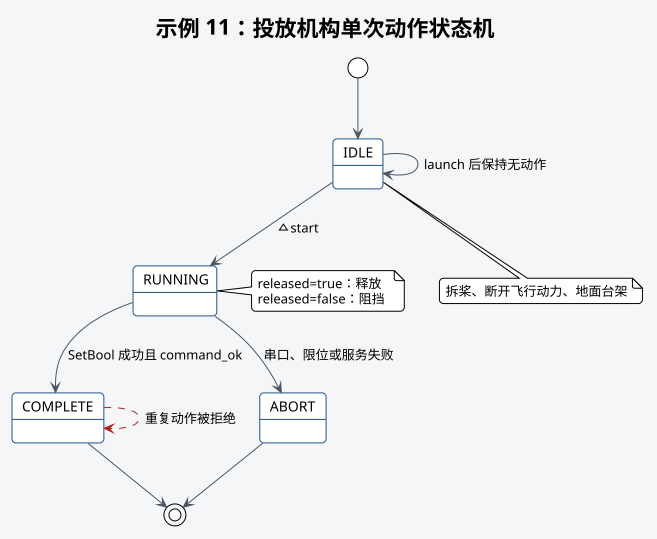

# 示例 11：投放机构动作



## 目的

手动启动后调用一次舵机服务，完成阻挡或释放动作，不与飞行示例联动。

## 前置条件

- 飞行动力断开，桨叶拆除，机构固定在地面台架。
- 如果本次是在调试或标定舵机，必须先拆下输出轴上的舵盘、齿轮、连杆、挂钩和其他旋转附件；
  带载台架检查则按[舵机投放机构标定](../10-servo-release-calibration.md)中的步骤执行。
- 已完成[舵机投放机构标定](../10-servo-release-calibration.md)。
- `<舵机设备>`、供电、软件限位和机械净空已经确认。

## 启动命令

释放动作：

```bash
# 启动投放机构示例并选择释放位置。
roslaunch robotac_examples 11_payload_release.launch \
  released:=true servo_port:=<舵机设备>
# 请求示例执行一次释放动作。
rosservice call /robotac_examples/payload_release/start "{}"
```

阻挡动作将 `released` 改为 `false`。每次节点运行只执行一次。

## 预期输出

`~state` 从 `IDLE` 进入 `RUNNING`，成功后为 `COMPLETE`。同时检查
`/robotac_servo/connected`、`/robotac_servo/state` 和 `/robotac_servo/command_ok`。

## 失败判断

- 串口不可用或被占用：服务失败，状态进入 `ABORT`。
- 重复动作被拒绝：重新确认实际机构位置后重启节点，不得连续强制调用。
- 串口成功但机构未完全动作：断电检查供电、连杆、限位和卡滞。

## 下一步

带载台架验证通过后，由队伍程序自行决定与飞行流程的接口和安全条件。本示例不提供自动
投放时机或落点控制。
