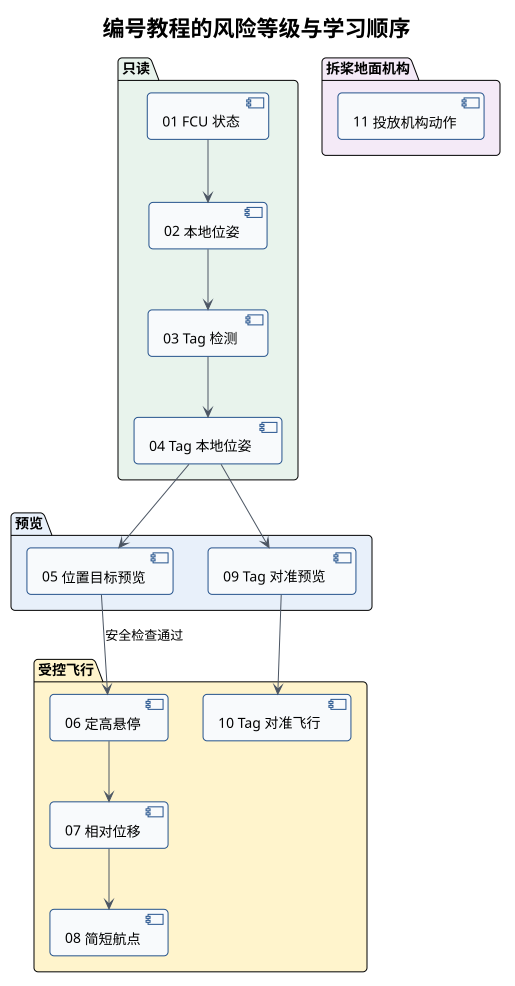

# 编号示例教程

教程按“先读取数据、再预览目标、最后控制机构或飞机”的顺序编排。`01` 至 `05`、`09` 只读取
或预览数据；`06`、`07`、`08`、`10` 会控制飞机；`11` 单独检查投放机构。

| 编号 | 教程 | 类别 |
| --- | --- | --- |
| 01 | [FCU 状态](01-fcu-state.md) | 只读 |
| 02 | [定位链路与本地位姿](02-local-pose.md) | 只读 |
| 03 | [AprilTag 原始检测](03-apriltag-detection.md) | 只读 |
| 04 | [AprilTag 本地位姿](04-apriltag-local-pose.md) | 只读转换 |
| 05 | [位置目标预览](05-setpoint-preview.md) | 预览 |
| 06 | [定高悬停](06-hover.md) | 飞行 |
| 07 | [相对位移](07-move-relative.md) | 飞行 |
| 08 | [简短航点](08-waypoints.md) | 飞行 |
| 09 | [Tag 对准预览](09-tag-centering-preview.md) | 预览 |
| 10 | [Tag 对准飞行](10-tag-centering-flight.md) | 飞行 |
| 11 | [投放机构动作](11-payload-release.md) | 地面机构 |

## 前置组件

| 示例 | MAVROS | 激光定位 | RGB 相机 | AprilTag | PX4 外部视觉融合 |
| --- | --- | --- | --- | --- | --- |
| 01 | 需要 | 不需要 | 不需要 | 不需要 | 不需要 |
| 02 | 需要 | 需要 | 不需要 | 不需要 | 需要 |
| 03 | 不需要 | 不需要 | 需要 | 需要 | 不需要 |
| 04 | 需要 | 需要 | 需要 | 需要 | 需要 |
| 05 | 不需要 | 不需要 | 不需要 | 不需要 | 不需要 |
| 06 | 需要 | 需要 | 不需要 | 不需要 | 需要 |
| 07 | 需要 | 需要 | 不需要 | 不需要 | 需要 |
| 08 | 需要 | 需要 | 不需要 | 不需要 | 需要 |
| 09 | 需要 | 需要 | 需要 | 需要 | 需要 |
| 10 | 需要 | 需要 | 需要 | 需要 | 需要 |
| 11 | 不需要 | 不需要 | 不需要 | 不需要 | 不需要 |

“激光定位”表示 MID360、FAST-LIO 和修正里程计均已正常运行。“PX4 外部视觉融合”表示
位姿已通过 MAVROS 送入 PX4，并且 `/mavros/estimator_status` 与
`/mavros/local_position/pose` 已经确认正常。飞行示例 launch 不会自动启动这些前置组件。

会控制飞机的示例必须遵守[安全与验证](../06-safety-and-validation.md)。示例中的高度、距离、
超时和航点仅用于教学，不是比赛参数。
